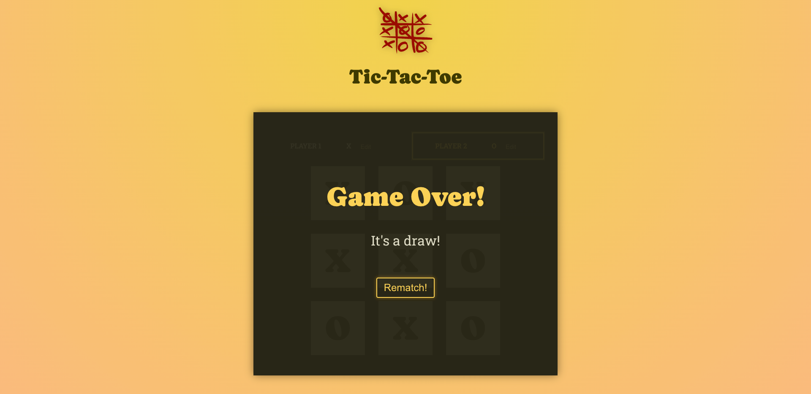

 <h2>About the project</h2>

   
A fully responsive <b>tic-tac-toe</b> game. With loads of features. Hope you enjoy playing it.

   <h3>Feature include </h3>

- Ability to set each players name.
- Game over screen
  - Game ends in either a win or a draw
- Rematch functionality
- Fully responsive design, enjoy on mobile/desktop or tablet.

👉 Live Demo: <a href='https://tic-tac-toe-five-inky.vercel.app/'>Live Demo</a>

 <h3>Build with:</h3>

» Typescript
» React JS

 <h3>Tools:</h3>

» Vite

 <h2>Screenshots of the Project 📸</h2>
  
 

 <h3>Desktop</h3>
 

 <h3>Mobile</h3>
 

 <h3>Game Over</h3>
 <h2>Winner</h2>
 
 <h2>Draw</h2>
 

